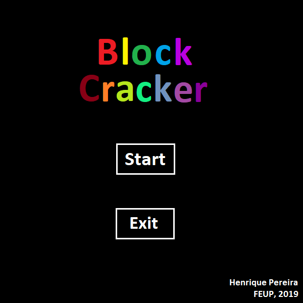

# Game for FPRO

Simple game made in python, with module PyGame.

This project is a clone of the original game, called [Breakout](https://en.wikipedia.org/wiki/Breakout_(video_game)), created by Atari Inc. as an Arcade Game for the Atari 2600.

### Prerequisites

Having the module PyGame installed

    try one of the following commands under the anaconda prompt or terminal:
    ```
    pip install pygame
    
    sudo apt-get install python3-pygame
    
    ```

## How to Run

 Open the file 'BlockCracker.py' with your python interpreter with pygame installed and click 'Run'.

## Built With

* [Python] - Programming Language used
* [PyGame] - Module used

## Authors

* **Henrique Manuel Ruivo Pereira** - *Main work* - GodAnri - up201806538@g.uporto.pt

## Acknowledgments

* **Ricardo Cruz** - *Supervisor* - rpcruz - rpcruz@fe.up.pt

## Game Screenshot


